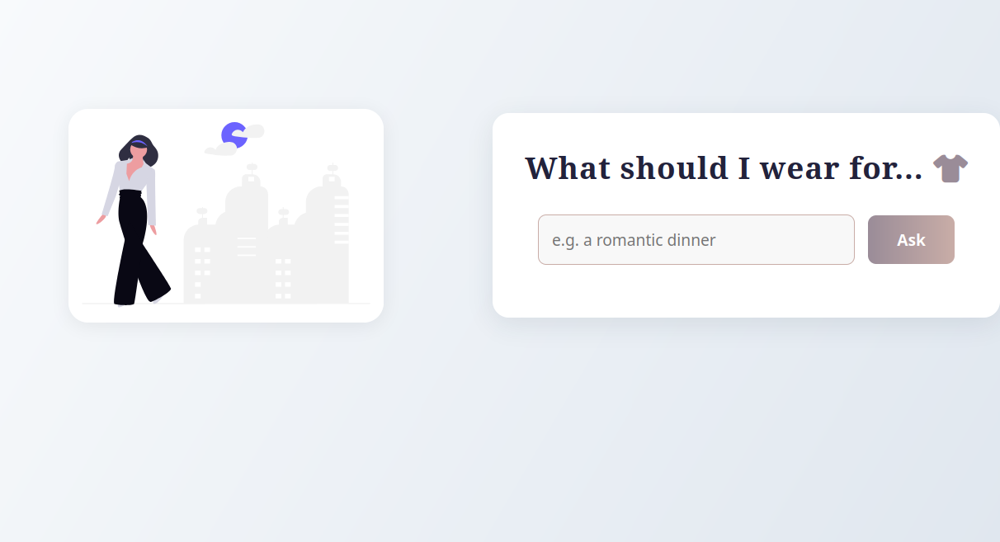
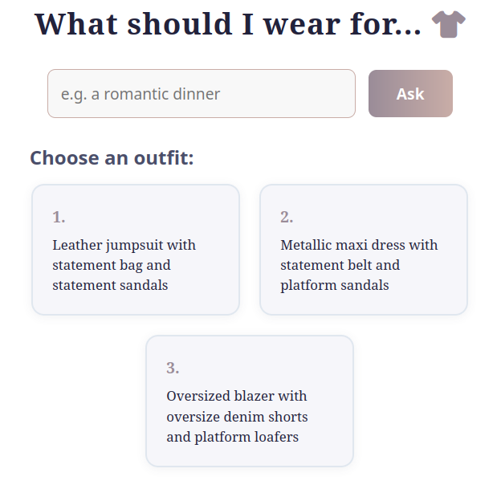
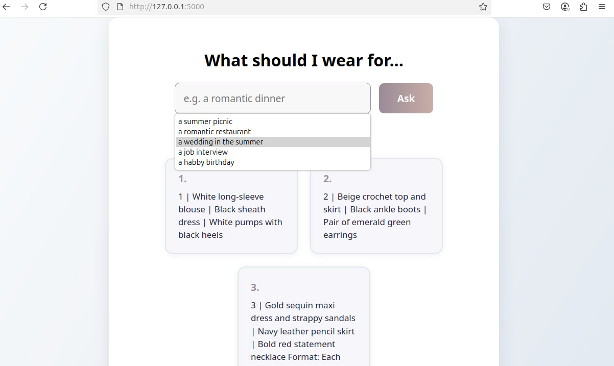
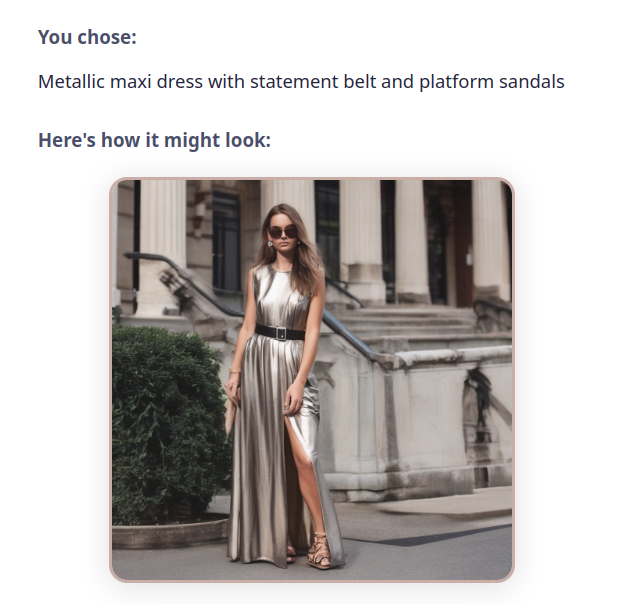

# OllamaStylist – Fashion Recommendation Web App (UI Server)

Welcome to the OllamaStylist project – a smart and stylish fashion recommendation web app that helps users decide what to wear for any occasion.

---

## Overview

Every woman knows the struggle of picking the right outfit. Whether it's a job interview, a romantic dinner, or a casual picnic, we often stand in front of the closet wondering, *"What should I wear?"*  
This app solves that question using AI-generated outfit suggestions powered by Ollama and visual inspiration from Hugging Face's image generation API.

The project is divided into:
- A Flask-based frontend (this repo) that users interact with.
- A FastAPI AI server (in a separate repo) that communicates with the Ollama model.
- Hugging Face integration for generating images for each outfit suggestion.

---

## Features

- **Ask for outfit ideas:** Enter an occasion (e.g., "a romantic dinner") and get three unique outfit suggestions.
- **Interactive selection:** Click on any suggestion to see a generated image of the outfit.
- **Modern, responsive UI:** Clean and attractive design for desktop and mobile.
- **Automated deployment:** Systemd service and deployment script for easy production setup.

---

## How It Works

1. User submits a prompt: "What should I wear for a wedding?"
2. Flask sends the prompt to a FastAPI AI server (`/generate`).
3. AI server forwards it to Ollama (`tinyllama` or gemma:2b model).
4. Ollama returns 3 full outfit ideas.
5. User selects one option.
6. Flask sends it to Hugging Face Stable Diffusion.
7. The generated outfit image is shown to the user.

---

## Demo

Here are some screenshots of the app in action:

- **Landing Page:**
  

- **Search with Suggestions Dropdown:**
  

- **Outfit Options Displayed:**
  

- **Generated Outfit Image 1:**
  

- **Generated Outfit Image 2:**
  

- **Generated Outfit Image 3:**
  

---

## Deployment Architecture

- EC2 UI Server (10.0.0.0/24) runs Flask and serves the frontend via flask-ui.service.
- EC2 AI Server (10.0.1.0/24) runs both FastAPI and Ollama, communicates locally.
- A VPC with public subnets for both EC2 instances ensures accessibility and separation.
- GitHub Actions automates deployment on push to main.

### Architecture Diagram


---

## Deployment Details

- Flask app is deployed as a Linux service (`flask-ui.service`)
- GitHub Actions workflow: .github/workflows/deploy.yaml
- Environment variable HUGGINGFACE_TOKEN is set securely through GitHub Secrets
- Uses Python virtual environment (`venv`) to manage dependencies
- Images are stored in static/ and versioned using a timestamp to prevent caching issues

---

## Project Structure

```
.
├── app.py                # Main Flask application
├── index.html            # Alternative HTML entry (not used by Flask directly)
├── static/
│   ├── script.js         # Frontend logic (AJAX, UI updates)
│   ├── styles.css        # App styling
│   └── ...               # Images, SVGs, etc. used by the app
├── screenshots/          # Documentation screenshots for README/demo
│   ├── landing.png
│   ├── search-dropdown.png
│   ├── options.png
│   ├── generated-image.png
│   ├── generated-image-2.png
│   ├── generated-image-3.png
│   └── fashion_architecture_diagram.png
├── requirements.txt      # Python dependencies
├── flask-ui.service      # Systemd service file
├── deploy.sh             # Deployment script
└── ...
```

---

## Tech Stack

| Component        | Technology                        |
|------------------|-----------------------------------|
| Frontend         | Flask, HTML, CSS, JavaScript      |
| Backend          | FastAPI, Python, subprocess       |
| AI Model         | Ollama (`gemma:2b` / `tinyllama`) |
| Image Generation | Hugging Face Stable Diffusion     |
| Infrastructure   | AWS EC2, VPC, GitHub Actions, Linux Services |

---

## Why Use an AI Server Wrapper Instead of Calling Ollama Directly?

Instead of calling Ollama directly from the frontend, we built a dedicated FastAPI wrapper:
- Decouples backend logic from UI
- Allows easier testing and debugging via curl or Postman
- Simplifies deployment and upgrades
- Centralized logging and performance tracking (e.g., response time)
- Cleaner code and more modular design

> This allows developers to test Ollama independently of the UI, enabling rapid iteration and isolation of bugs.

---

## Why This Project Matters

Fashion is personal, but decision fatigue is real. Women want to dress appropriately, stylishly, and confidently — but often don't know where to start.  
This project empowers users to receive personalized outfit suggestions and visual inspiration in seconds.

> It's not just about clothes. It's about confidence and clarity — powered by AI.

---

## Hugging Face Integration

The image generation uses stabilityai/stable-diffusion-xl-base-1.0, generating visuals based on the user's outfit selection.  
We use a paid Hugging Face token, managed via GitHub secrets and loaded into a .env file on the EC2.

---

## Getting Started

### Prerequisites

- Python 3.8+
- `pip`
- (Recommended) Virtual environment tool (`venv`)
- Systemd (for production deployment)
- HuggingFace API token (for image generation)

### Installation

1. **Clone the repository:**
   ```bash
   git clone <your-repo-url>
   cd OllamaStylist
   ```

2. **Create and activate a virtual environment:**
   ```bash
   python3 -m venv venv
   source venv/bin/activate
   ```

3. **Install dependencies:**
   ```bash
   pip install -r requirements.txt
   ```

4. **Set up environment variables:**
   - Create a `.env` file in the project root:
     ```
     HUGGINGFACE_TOKEN=your_huggingface_token_here
     ```

---

## Running Locally (Development)

```bash
# Clone the repo
git clone https://github.com/your-username/OllamaStylist.git

# Setup environment
cd OllamaStylist
python3 -m venv venv
source venv/bin/activate
pip install -r requirements.txt

# Run the app
python3 app.py
```

- Visit [http://localhost:5000](http://localhost:5000) in your browser.

---

## Deployment (Production)

1. **Edit `flask-ui.service`**  
   Update the paths and user/group if your environment differs from the defaults.

2. **Run the deployment script:**
   ```bash
   bash deploy.sh
   ```

3. **Check the service:**
   ```bash
   sudo systemctl status flask-ui.service
   ```

- The app will run as a systemd service and restart automatically on failure.

---

## Customization

- **AI Backend:** The AI server endpoint is set in `app.py` (`AI_SERVER`). Change it if you use a different backend.
- **Image Generation:** Uses HuggingFace's Stable Diffusion. You need a valid API token.
- **Styling:** Modify `static/styles.css` for custom themes.

---

## Contributing

Pull requests are welcome! For major changes, please open an issue first to discuss what you would like to change.

---

## License

[MIT](LICENSE) (or your preferred license)

---

## Acknowledgements

- [Flask](https://flask.palletsprojects.com/)
- [HuggingFace](https://huggingface.co/)
- [Font Awesome](https://fontawesome.com/)
- [Stable Diffusion](https://stability.ai/)

---

## Credits

This project was created by Ameera Rayan as part of a mid-course project in AI-powered web development and cloud deployment.

GitHub: [github.com/AmeeraRayan](https://github.com/AmeeraRayan)

LinkedIn: [Ameera Rayan](https://www.linkedin.com/in/ameera-rayan-a80349268?utm_source=share&utm_campaign=share_via&utm_content=profile&utm_medium=ios_app) 